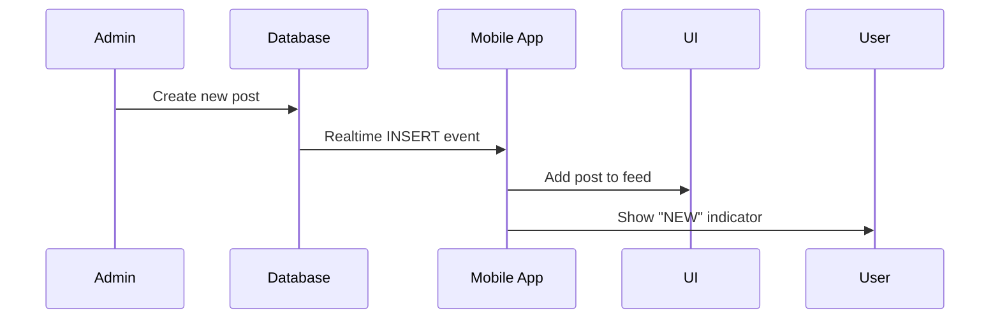
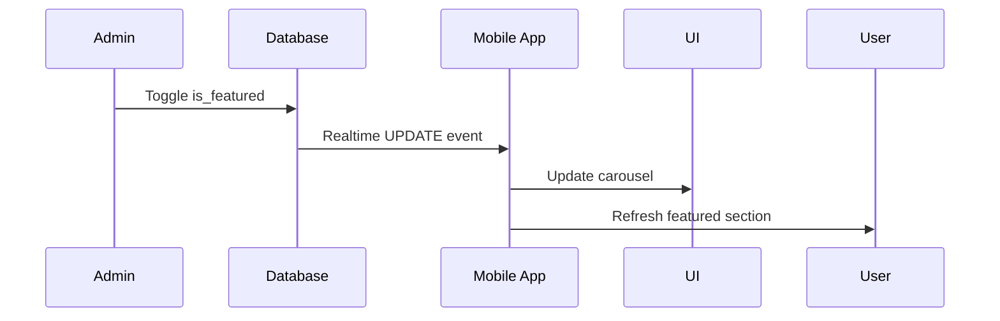
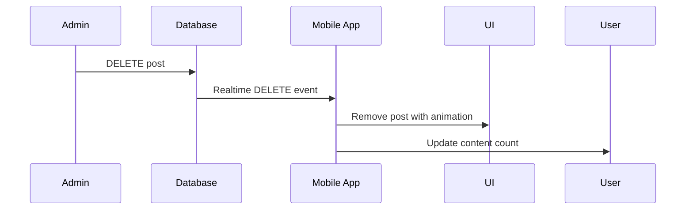

# Admin Panel Integration

This document details the integration between the Hamaki admin web panel and the React Native mobile app, including API design, real-time synchronization, and deployment considerations.

## Integration Overview

The admin panel serves as the central content management system for the Hamaki mobile app. Changes made in the web interface immediately reflect in all connected mobile app instances through real-time database subscriptions.

## API Design

### RESTful Endpoints

All API endpoints follow REST conventions and return consistent response formats:

#### Posts Management
```
GET    /api/v1/posts
POST   /api/v1/posts
GET    /api/v1/posts/{id}
PUT    /api/v1/posts/{id}
DELETE /api/v1/posts/{id}
```

#### Featured Posts Management
```
PATCH  /api/v1/posts/{id}/feature     # Toggle featured status
PUT    /api/v1/posts/reorder          # Bulk reorder featured posts
```

#### File Upload
```
POST   /api/v1/upload                 # Upload thumbnails and images
```

### Request/Response Formats

#### Standard API Response
```json
{
  "success": boolean,
  "data": any,
  "message": string,
  "error": string | null
}
```

#### Post Object
```json
{
  "id": "uuid",
  "type": "video|blog|hiring|announcement",
  "title": "string",
  "excerpt": "string",
  "content": "string",
  "thumbnail": "string",
  "isPublished": boolean,
  "publishedAt": "iso-date",
  "isFeatured": boolean,
  "featuredOrder": number,
  "metadata": {
    // Type-specific fields
  },
  "createdAt": "iso-date",
  "updatedAt": "iso-date"
}
```

#### Content Type Metadata Examples

**Video Post**:
```json
{
  "metadata": {
    "videoId": "dQw4w9WgXcQ",
    "duration": "10:45",
    "viewCount": "1.2M"
  }
}
```

**Blog Post**:
```json
{
  "metadata": {
    "tags": ["news", "update"],
    "readTimeMinutes": 5,
    "language": "en"
  }
}
```

**Hiring Post**:
```json
{
  "metadata": {
    "position": "Video Editor",
    "company": "HamaKi Studio",
    "applicationUrl": "mailto:jobs@hamaki.studio",
    "location": "Remote",
    "salary": "Competitive"
  }
}
```

**Announcement Post**:
```json
{
  "metadata": {
    "badge": "HOT",
    "priority": "high",
    "expiresAt": "2024-12-31T23:59:59Z"
  }
}
```

## Database Integration

### Connection Configuration

Both admin panel and mobile app connect to the same Supabase instance:

```typescript
// Shared configuration
const supabaseConfig = {
  url: process.env.SUPABASE_URL,
  anonKey: process.env.SUPABASE_ANON_KEY,
  auth: {
    autoRefreshToken: true,
    persistSession: true
  }
}
```

### Row Level Security (RLS)

Content posts require appropriate RLS policies:

```sql
-- Allow public read access to published posts
CREATE POLICY "Public can view published posts"
ON content_posts FOR SELECT
USING (is_published = true);

-- Admin users can perform all operations
CREATE POLICY "Admins can manage all posts"
ON content_posts
USING (auth.jwt() ->> 'role' = 'admin');
```

## Real-time Synchronization

### Supabase Realtime Setup

#### Enable Realtime
```sql
ALTER publication supabase_realtime ADD TABLE content_posts;
```

#### Mobile App Subscription
```typescript
const subscription = supabase
  .channel('content_posts_channel')
  .on('postgres_changes', {
    event: '*',
    schema: 'public',
    table: 'content_posts'
  }, handleRealtimeUpdate)
  .subscribe();
```

### Event Handling

#### INSERT Events
- **Trigger**: New post created in admin panel
- **Action**: Add to mobile app if published
- **UI Update**: Show "NEW" indicator

#### UPDATE Events
- **Trigger**: Post modified in admin panel
- **Actions**:
  - Published → Add/update in mobile app
  - Unpublished → Remove from mobile app
  - Featured status changed → Update carousel
- **UI Update**: Refresh affected sections

#### DELETE Events
- **Trigger**: Post deleted in admin panel
- **Action**: Remove from mobile app immediately
- **UI Update**: Animate removal

### Conflict Resolution

Since the admin panel is the single source of truth for content, conflicts are resolved by:

1. **Admin changes override**: Mobile app always accepts admin changes
2. **Last write wins**: For simultaneous admin operations
3. **Optimistic updates**: Mobile app updates immediately, reverts on error

## Content Synchronization Flow

### 1. Content Creation


### 2. Feature Toggle


### 3. Content Deletion


## Authentication & Security

### Admin Authentication

The admin panel uses separate authentication from the mobile app:

```typescript
// Admin-specific auth
interface AdminSession {
  user: {
    id: string;
    email: string;
    role: 'admin' | 'editor';
  };
  accessToken: string;
  refreshToken: string;
}
```

### API Security

#### Request Validation
- **Input sanitization**: All user inputs cleaned
- **Type validation**: Strict TypeScript interfaces
- **File upload limits**: Size and type restrictions

#### Database Security
- **Parameterized queries**: Prevent SQL injection
- **RLS policies**: Row-level access control
- **Audit logging**: Track all admin operations

## Error Handling

### Mobile App Resilience

#### Connection Issues
```typescript
// Fallback strategies
const handleConnectionError = () => {
  // 1. Use cached content
  // 2. Show offline indicator
  // 3. Retry with exponential backoff
  // 4. Queue failed operations
};
```

#### Sync Failures
```typescript
// Recovery mechanisms
const handleSyncFailure = () => {
  // 1. Log error details
  // 2. Refresh full dataset
  // 3. Notify user if critical
  // 4. Report to monitoring
};
```

### Admin Panel Error Handling

#### Form Validation
- **Client-side**: Immediate feedback
- **Server-side**: Final validation
- **User-friendly**: Clear error messages

#### Operation Failures
- **Retry mechanisms**: For transient errors
- **Rollback support**: For partial failures
- **Status indicators**: Show operation progress

## Performance Optimization

### Mobile App Optimizations

#### Efficient Updates
```typescript
// Only update affected components
const handleRealtimeUpdate = (payload) => {
  switch (payload.eventType) {
    case 'INSERT':
      // Add single item to beginning of list
      break;
    case 'UPDATE':
      // Update specific item in place
      break;
    case 'DELETE':
      // Remove specific item
      break;
  }
};
```

#### Memory Management
- **Pagination**: Limit loaded posts
- **Image optimization**: Thumbnail compression
- **Cache eviction**: Remove old content

### Database Optimizations

#### Query Performance
```sql
-- Optimized queries with proper indexes
EXPLAIN ANALYZE SELECT * FROM content_posts 
WHERE is_published = true 
ORDER BY created_at DESC 
LIMIT 20;
```

#### Connection Pooling
- **Supabase handles**: Automatic connection management
- **Mobile apps**: Share connection pool
- **Admin panel**: Separate connection pool

## Deployment Considerations

### Environment Configuration

#### Mobile App Variables
```typescript
// expo-constants configuration
export const CONFIG = {
  SUPABASE_URL: Constants.expoConfig?.extra?.supabaseUrl,
  SUPABASE_ANON_KEY: Constants.expoConfig?.extra?.supabaseAnonKey,
  ADMIN_API_URL: Constants.expoConfig?.extra?.adminApiUrl
};
```

#### Admin Panel Variables
```bash
# Environment variables
SUPABASE_URL=https://your-project.supabase.co
SUPABASE_ANON_KEY=your-anon-key
SUPABASE_SERVICE_KEY=your-service-key
JWT_SECRET=your-jwt-secret
UPLOAD_MAX_SIZE=10MB
```

### Monitoring & Analytics

#### Real-time Connection Health
```typescript
// Monitor connection status
supabase
  .channel('heartbeat')
  .on('system', {}, (payload) => {
    if (payload.event === 'phx_error') {
      // Handle connection issues
    }
  })
  .subscribe();
```

#### Content Performance Metrics
- **Update latency**: Time from admin to mobile
- **Error rates**: Failed synchronizations
- **User engagement**: Content interaction rates
- **System load**: Database and API performance

## Testing Strategy

### Integration Testing

#### End-to-End Flow
1. Create content in admin panel
2. Verify appearance in mobile app
3. Modify content properties
4. Confirm updates in mobile app
5. Delete content
6. Validate removal from mobile app

#### Edge Cases
- **Network interruptions**: During content operations
- **Concurrent modifications**: Multiple admin users
- **Large content volumes**: Performance under load
- **Mobile app backgrounding**: Connection resumption

### Load Testing

#### Concurrent Users
```typescript
// Simulate multiple mobile app connections
const simulateUsers = async (count: number) => {
  const connections = Array.from({ length: count }, () =>
    createSupabaseClient()
  );
  
  // Test realtime performance
  connections.forEach(client => {
    client.channel('load_test').subscribe();
  });
};
```

## Troubleshooting Guide

### Common Issues

#### Mobile App Not Updating
1. **Check realtime status**: Verify subscription active
2. **Inspect network**: Ensure connectivity
3. **Review filters**: Confirm event matching
4. **Clear cache**: Force fresh data

#### Admin Changes Not Reflecting
1. **Verify database write**: Check successful operation
2. **Confirm publication**: Ensure `is_published = true`
3. **Review RLS policies**: Check permissions
4. **Monitor realtime logs**: Supabase dashboard

#### Performance Issues
1. **Database queries**: Check for missing indexes
2. **Payload size**: Minimize realtime event data
3. **Connection count**: Monitor active subscriptions
4. **Memory usage**: Profile mobile app performance

### Debugging Tools

#### Supabase Dashboard
- **Realtime inspector**: Monitor live events
- **Query performance**: Analyze slow queries
- **Connection metrics**: Active subscription count

#### Mobile App Debugging
```typescript
// Enable detailed logging
const debugMode = __DEV__;
if (debugMode) {
  console.log('Realtime event:', payload);
  console.log('Current posts count:', posts.length);
  console.log('Featured posts:', featuredPosts.length);
}
```

## Future Enhancements

### Planned Features
- **Content scheduling**: Publish at specific times
- **Bulk operations**: Mass content management
- **Content templates**: Predefined post formats
- **Advanced permissions**: Role-based access control
- **Analytics integration**: Content performance tracking
- **Multi-language support**: Localized content management

### Technical Improvements
- **GraphQL API**: More efficient data fetching
- **CDN integration**: Faster image delivery
- **Offline support**: Local content caching
- **Push notifications**: Real-time user alerts
- **Content validation**: Automated quality checks